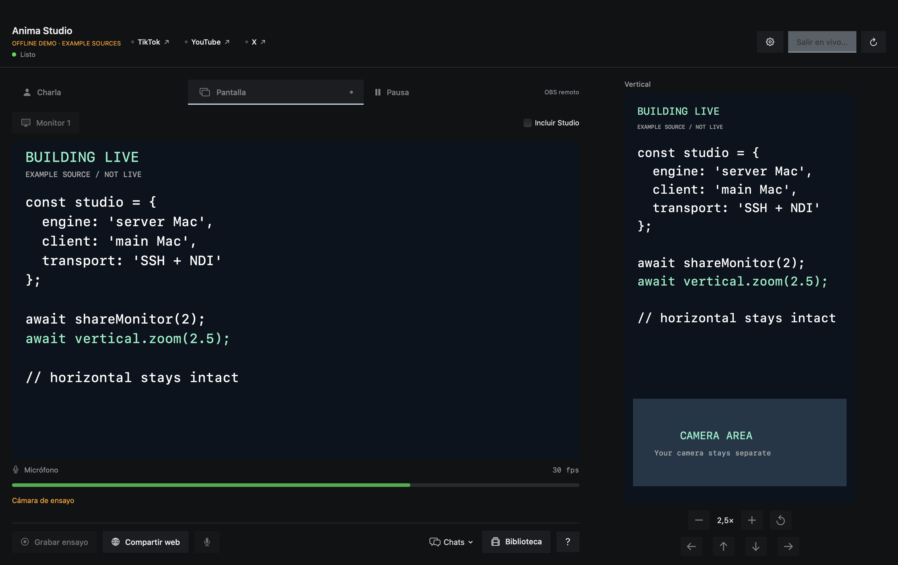

# Anima Studio

**Your spare Mac runs OBS. Your main Mac runs the show.**

A native remote control panel for a two-computer streaming setup. Keep OBS,
encoding and recording on a dedicated machine. Switch scenes, send one monitor
and frame your vertical stream from the computer you're actually using.



**[Watch / download the 56-second demo](https://github.com/GBurgardt/anima-studio/releases/download/v0.1.0/anima-studio-demo.mp4)**
— silent explainer with example sources, not a public broadcast.

```text
YOUR MAIN MAC                         YOUR STREAMING SERVER
Anima Studio  ─── SSH controls ──────→ Node bridge → OBS
One monitor   ─── NDI video ─────────→ DistroAV     → streams
              ←── previews/files ───               → recordings
```

## What it does

- **Talk / Screen / Pause** without operating the OBS interface remotely.
- **One-click monitor selection.** Only the selected display is captured.
- **Independent vertical zoom and pan.** Make code readable without cropping the horizontal stream.
- **Horizontal + vertical previews** (periodic snapshots, not audio/video monitoring).
- Recording controls and **copy recordings back** without deleting server originals.
- Optional local **Elgato Key Light** on/off and brightness.
- Optional [clean recording setup](docs/CLEAN-RECORDING.md): live overlays stay out of your editing master.
- Explicit confirmation before starting configured public outputs. No automatic browser control, cloud account or analytics collection.

**Closing the panel does not stop OBS. It DOES stop the monitor feed sent by this client.**
Keep the client open while sharing its screen. Camera/audio must reach OBS separately.

## Start here

**Developer beta / macOS client.** This is a small open-source tool, not a one-click OBS installer.
The original setup uses two Macs. The Node bridge is portable JavaScript, but Windows/Linux
server installation is not validated and there is no Windows/Linux client yet.

1. **Server:** install OBS + Node 22.4+, configure your scenes and enable OBS WebSocket.
2. Clone this repo on the server and run `node Scripts/init-server.mjs`.
3. Edit `~/.config/anima-studio/server.json` on the server. Keep the OBS password there.
4. **Client:** clone, install Xcode command-line tools, run `bash Scripts/build.sh`.
5. Open `dist/Anima Studio Public.app`, enter your SSH alias and server paths in Settings.

**[Step-by-step setup →](docs/SETUP.md)** · **[Security →](SECURITY.md)** · **[Test scope →](docs/TESTING.md)**

NDI screen sharing requires [NDI runtime/tools](https://ndi.video/tools/) on the client
and [DistroAV](https://github.com/DistroAV/DistroAV) on the OBS server.
Vertical output/zoom requires [Aitum Vertical](https://github.com/Aitum/obs-vertical-canvas)
and a canvas-aware OBS WebSocket build (the originating setup uses OBS 32).
Horizontal control and recording do not require these plugins.

## Destinations

Use OBS's main output and optionally named plugin outputs or an Aitum vertical output.
YouTube, TikTok and X are the original use case, not mandatory accounts.
Configure RTMP credentials in OBS, not in this repo. Platform eligibility, stream keys,
event creation and final publication still belong to each platform. Sending video is
not proof that the broadcast is public. Inspect the official dashboards.

## Why I built it

I wanted to stream while building things with AI, not keep operating a broadcast desk.
OBS lives on a Mac I use as a home server; the other Mac is where I work.
This panel grew out of those streams.

[The spare-computer idea, in my own words](https://www.instagram.com/reel/Dd4kWswCCPq/).

## Development

```sh
npm test
swift test
```

No npm dependencies. SwiftUI/AppKit client, ScreenCaptureKit capture, SSH JSON-line
bridge, OBS WebSocket v5. OBS and plugins are separate projects; no binaries are bundled.
NDI® is a registered trademark of Vizrt NDI AB. [NDI](https://ndi.video).

MIT license for this repository's code. Third-party tools retain their own licenses.
